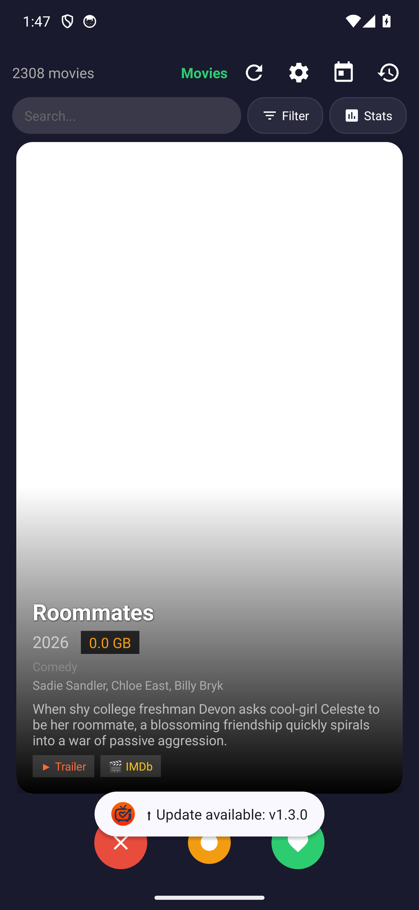
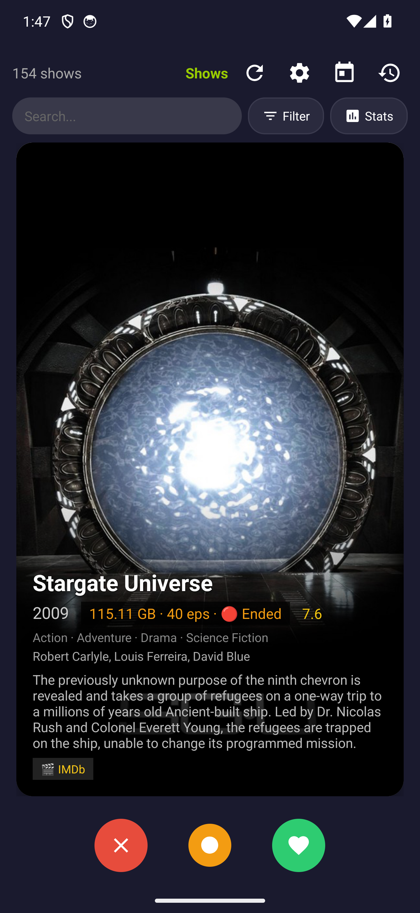
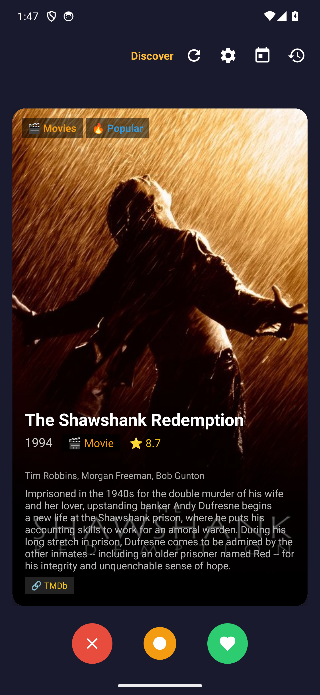
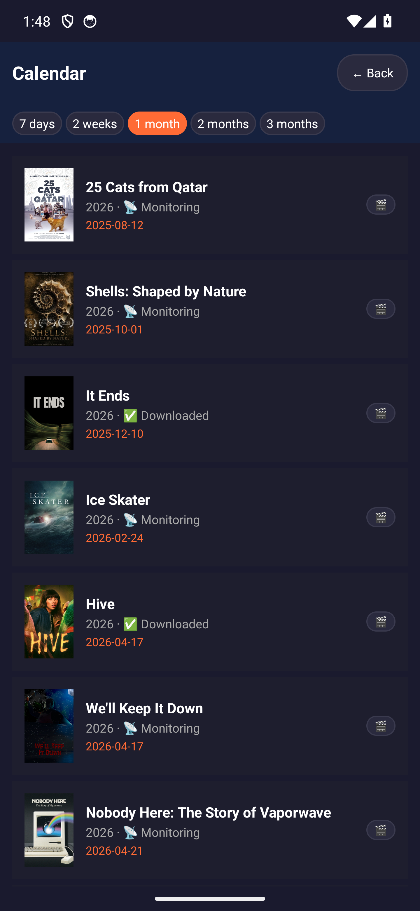
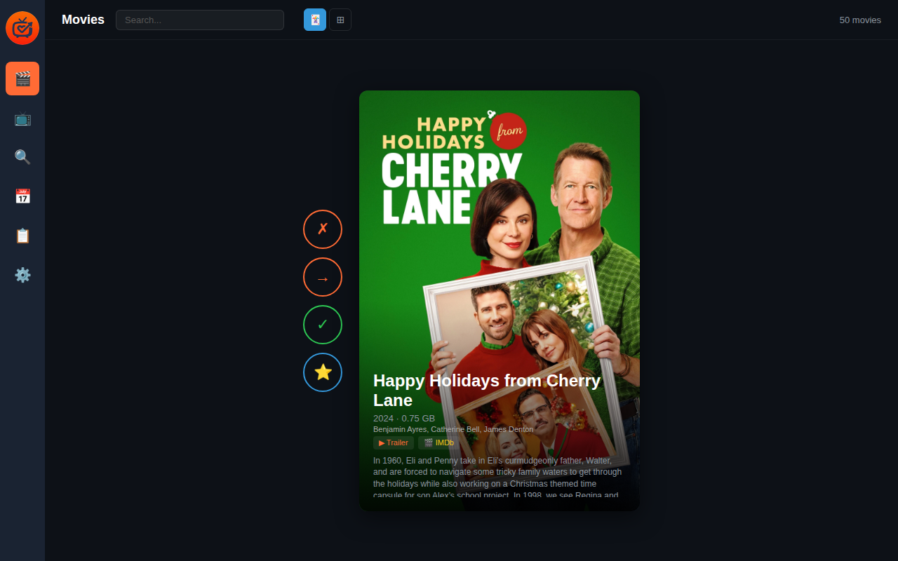
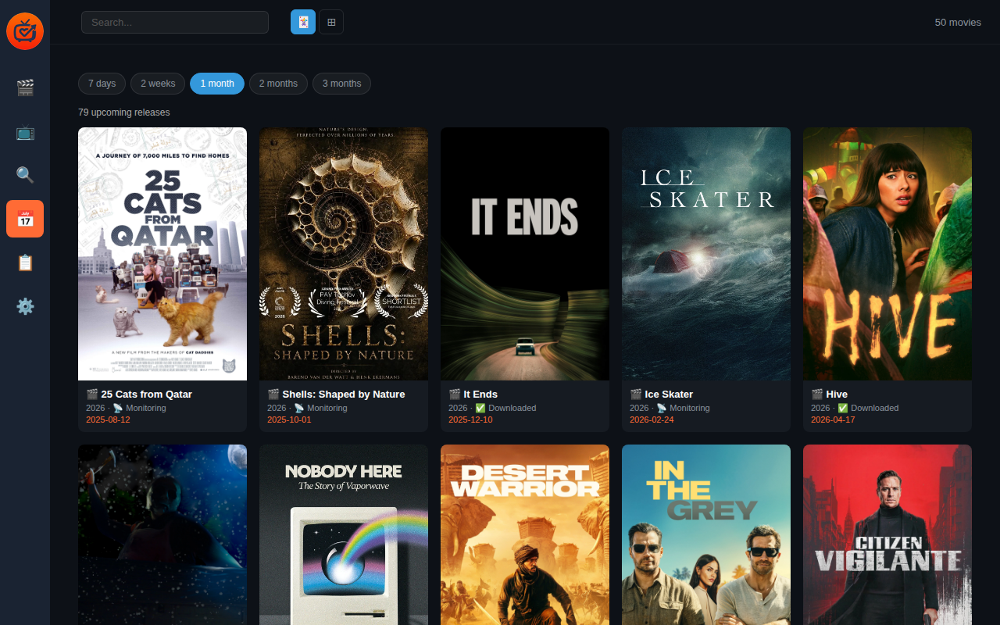

# TV Tenderr

A Tinder-style app for managing your Plex media library. Swipe through movies and TV shows to keep, block, or clean up your collection.


## Features

- **Swipe gestures** — right to keep, left to block (deletes files, prevents re-addition), down for super keep
- **Cast display** — top 3 actors from TMDb on every movie, show, and discover card
- **Plex watched status** — see which movies/shows you've already watched in Plex
- **Trailer & IMDb links** — tap to watch trailers on YouTube or view on IMDb
- **Search & filter** — search by title, filter by genre, year range, and minimum rating
- **Swipe statistics** — see totals for kept, blocked, super kept, skipped across movies, shows, and discover
- **Calendar view** — upcoming releases from Radarr and Sonarr with monitoring/downloaded status
- **Plex integration** — refresh libraries from your phone
- **Radarr & Sonarr** — manage movies and TV shows
- **Discover** — find new content from all streaming services via TMDb with TMDb links
- **Quality settings** — configure quality profiles and root folders
- **Undo protection** — 10-second window before destructive actions
- **History** — track all decisions with undo capability
- **Web GUI** — desktop interface with card and grid views, all features mirrored

## Quick Start

```bash
git clone https://github.com/croycrabtree/tv-tenderr.git
cd tv-tenderr
./setup.sh
# Edit .env with your credentials
python3 backend.py
```

## Documentation

- **[User Guide](USER_GUIDE.md)** — complete usage instructions for app and web GUI
- **[Setup Guide](#setup)** — installation and configuration

## Screenshots

### Android App





### Web UI



### Features
- Card-based interface with swipe gestures
- Movies, Shows, and Discover modes
- Settings for all service connections

### Web GUI
- Dark theme matching Radarr/Sonarr aesthetic
- Card view (swipe) and Grid view (browse)
- Full feature parity with Android app

## Architecture

```
tv-tenderr/
├── backend.py          # FastAPI server
├── android/            # Android app (Kotlin)
├── web/                # Web GUI (HTML/CSS/JS)
├── data/               # Local data storage
├── .env.example        # Environment template
└── setup.sh            # Installation script
```

## API Endpoints

- `GET /api/movies` — list all movies
- `GET /api/shows` — list all shows
- `POST /api/movies/{id}/keep` — keep a movie
- `POST /api/movies/{id}/block` — block a movie (deletes files, adds import list exclusion — prevents re-addition from lists)
- `GET /api/discover/movies` — discover new movies
- `GET /api/discover/shows` — discover new shows
- `POST /api/plex/refresh` — refresh Plex libraries
- `GET /api/config` — get configuration
- `POST /api/config` — update configuration

## Requirements

- Python 3.10+
- Radarr instance with API key
- Sonarr instance with API key
- Plex server with token
- TMDb API key (free at themoviedb.org)

## License

MIT
